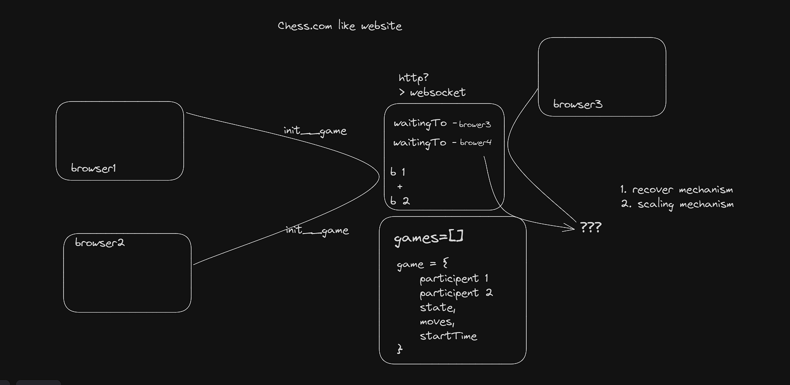

# chess.tpr
Chess.tpr is built using React and TypeScript for a robust and type-safe frontend, ensuring maintainable and scalable code. The styling is powered by Tailwind CSS, enabling a highly responsive and modern design with minimal effort. Real-time communication is achieved through WebSocket technology, facilitating instant player interactions and synchronized gameplay, delivering a seamless and interactive chess experience.

Sysytem design
